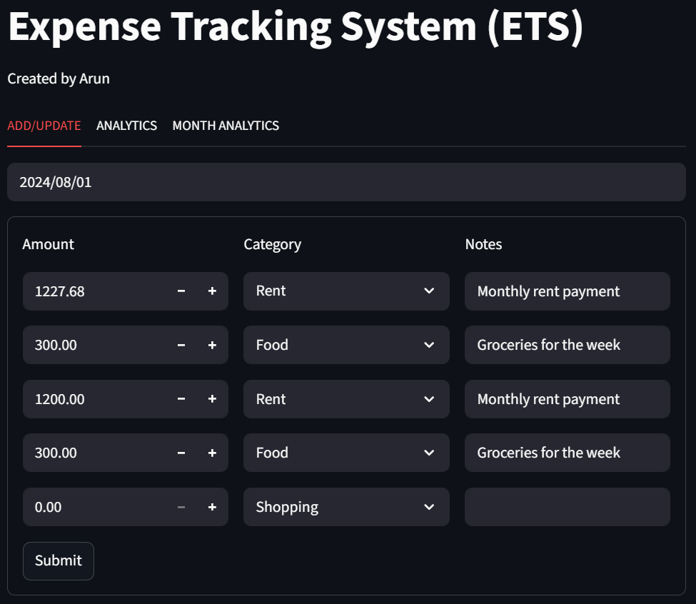
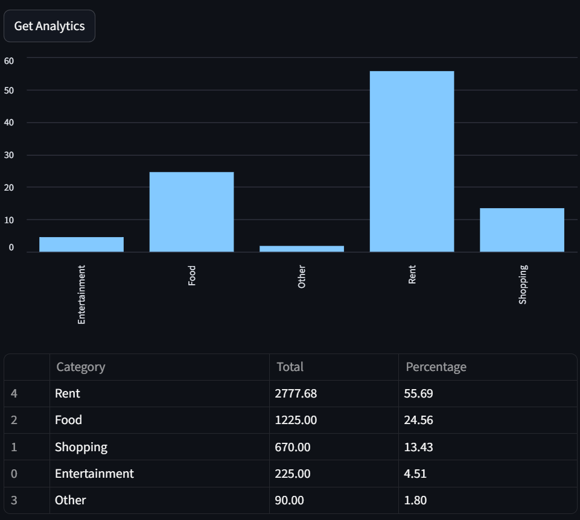
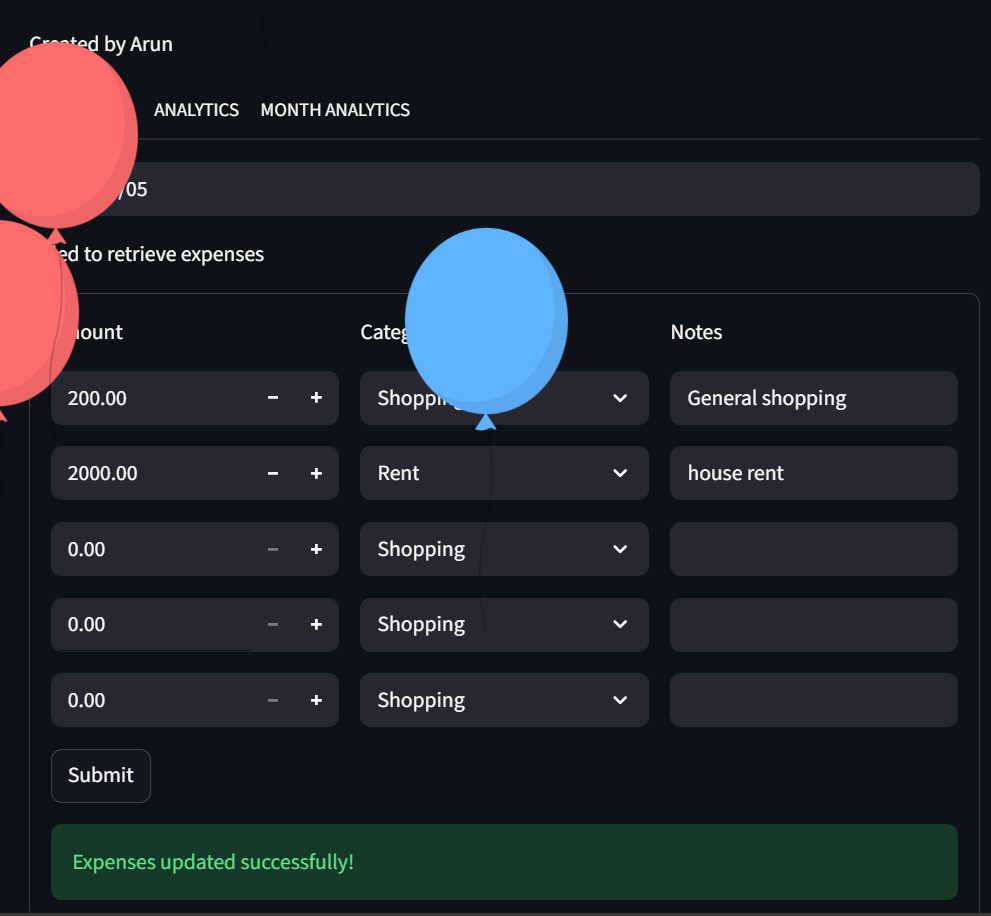

<h1 align="center">💰 Expense Management System</h1>
<p align="center">
  <i>Track smarter. Spend wiser. Built for humans, powered by FastAPI ⚡ + Streamlit 🎨</i>
</p>

<p align="center">
  
  
  
  
  
</p>

---

## 🪄 About the Project  

**Expense Management System** isn’t just another tracker — it’s your *personal finance buddy*.  
With a buttery-smooth **Streamlit frontend** and a **FastAPI backend**, it helps you manage your expenses with ease, style, and speed.  

💸 **Add. Analyze. Optimize. Repeat.**  

---

## 🧠 Why This Project?  

Let’s be honest — managing expenses sucks sometimes.  
So, I built a tool that makes it **simple, fast, and visual**.  
Whether you're a freelancer, student, or business owner — this system helps you stay *financially sane* while making data look *cool*.  

---

## 🧩 Tech Stack  

| Layer | Technology | Description |
|-------|-------------|-------------|
| 🎨 **Frontend** | [Streamlit](https://streamlit.io/) | Interactive, lightweight, and stunning web interface |
| ⚡ **Backend** | [FastAPI](https://fastapi.tiangolo.com/) | High-performance Python framework for APIs |
| 🧪 **Testing** | Pytest | Automated tests for reliability |
| 🐍 **Runtime** | Python 3.9+ | Cross-platform support |
| ⚡ **Database** | My SQL | High-performance back end system (free to use)|

---

## 📁 Project Structure  

```bash
expense-management-system/
│
├── frontend/              # 🎨 Streamlit app (UI + UX logic)
│   ├── app.py             # Main Streamlit app entry point
│   └── components/        # Reusable UI components
│
├── backend/               # ⚡ FastAPI server (API + data logic)
│   ├── server.py          # FastAPI app entry point
│   └── routes/            # API endpoint definitions
│
├── tests/                 # 🧪 Unit & integration tests
│   ├── test_backend.py
│   └── test_frontend.py
│
├── requirements.txt       # 🔧 Project dependencies
└── README.md              # 📘 Project documentation

```
---

## ⚙️ Setup Instructions  

### 🔹 Step 1: Clone the Repo  
```bash
git clone https://github.com/arun-vamadevan/Expense-Tracking-System.git
cd Expense-Tracking-System

pip install -r requirements.txt

uvicorn server:app --reload


streamlit run app.py
```
**UI**





